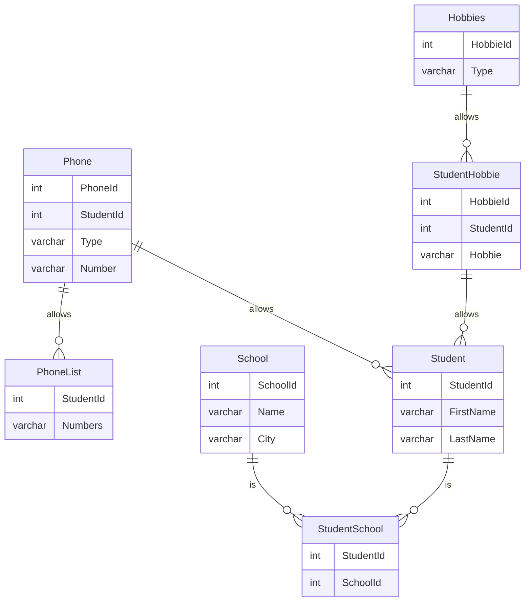

# db2022-labb

```mermaid
erDiagram


Student ||--o{ StudentSchool : is
Student {
  int StudentId
  varchar FirstName
  varchar LastName
}
School ||--o{ StudentSchool : is
School {
  int SchoolId
  varchar Name
  varchar City
}


StudentSchool {
int StudentId
int SchoolId
}

Phone || --o{ PhoneList : allows
Phone || --o{ Student : allows
Phone {
int PhoneId
int StudentId
varchar Type
varchar Number
}
PhoneList {
int StudentId
varchar Numbers
}


Hobbies || --o{ StudentHobbie : allows
Hobbies {
int HobbieId
varchar Type
}
StudentHobbie || --o{ Student : allows
StudentHobbie {
int HobbieId
int StudentId
varchar Hobbie
}

```
