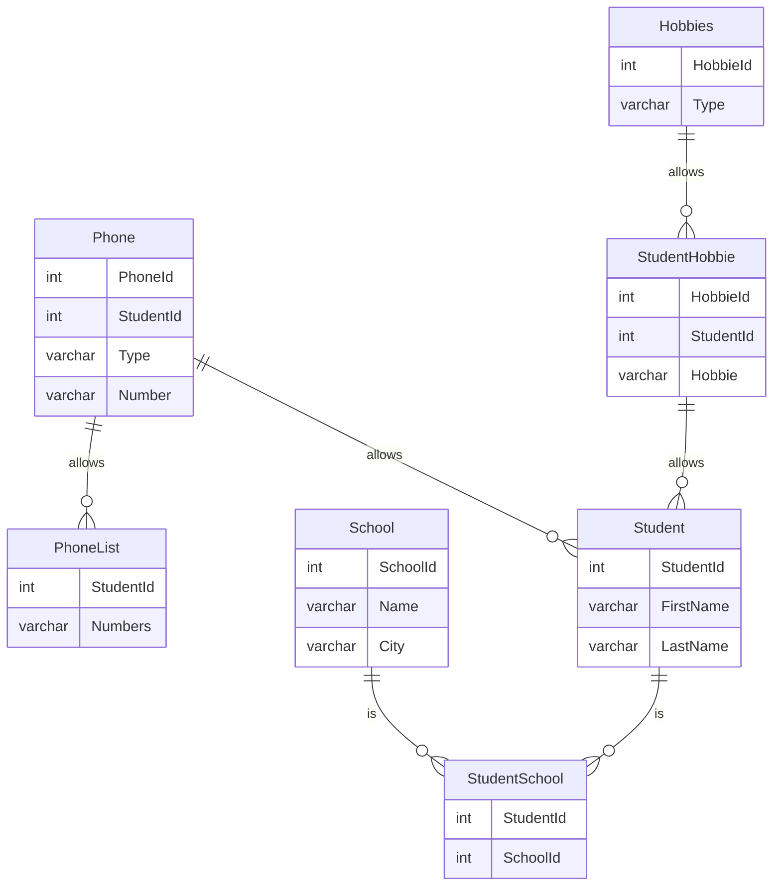

# db2022-labb

### Beskrivning
I kursen DB2022 på IT-Högskolan skulle vi redovisa på färdigheter i SQL, Normalisering samt Java mot en relationsdatabas. Detta är min redovisning från denna kurs.

Vi använder Mermaid, det är ett verktyg för att rita diagram i Markdown.

### Entity Relationship Diagram

## Instruktioner:

Clona projektet: git clone https://github.com/Ensosense/db2022-labb.git

För att köra projektet i Intellij: idea.cmd . för Windows, idea. för OS.

Kör skriptet: docker exec -i iths-mysql mysql -uiths -piths < normalizering.sql
